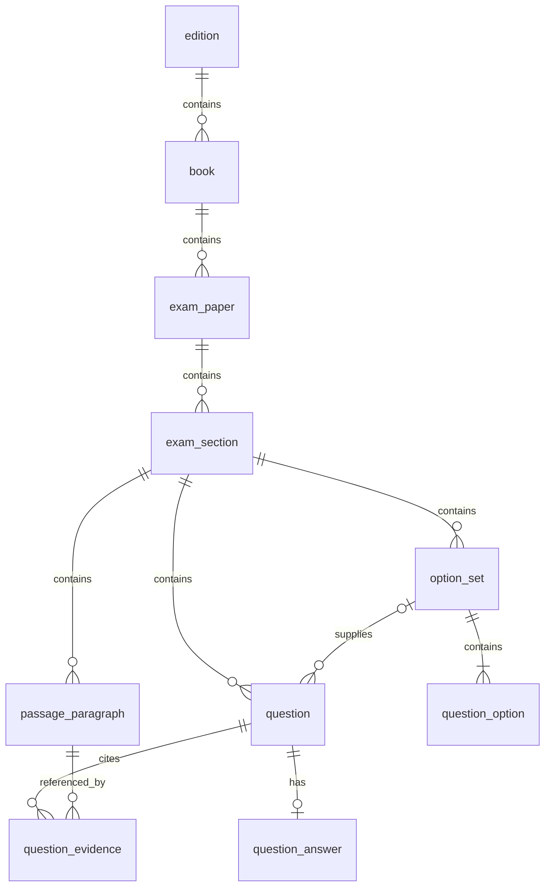

# FCE 题库数据库设计（第一期）

状态：已根据本设计生成 001—010 建表迁移，并配置 Flyway 命名规则；尚未对业务数据库执行迁移或导入数据。运行说明见 [Flyway 迁移说明](flyway-migrations.md)。

## 1. 范围与数据基线

数据库采用 PostgreSQL，第一期仅包含目录、试卷、原文、题目、选项、答案与题目解析，共 10 张业务表。后续通过项目现有 Flyway 管理数据库变更，保持 Hibernate `ddl-auto: none`。

数据来源是前端两个 HTML 中 `script#examData` 的 JSON，以及首页的版本、册、试卷目录。不能把 HTML 内所有功能代码视为已存在的业务内容。

| 来源 | Part | 题目 | 原文段落（含标题） | 证据条目 |
| --- | ---: | ---: | ---: | ---: |
| 标准版 1 Test 1 | 7 | 52 | 31 | 24 |
| 校园版 3 Test 1 | 7 | 52 | 38 | 73 |
| 合计 | 14 | 104 | 69 | 97 |

以上为本次从源文件解析得到的基线；97 条证据的段落标识均能在所属 Part 中找到。是否逐字匹配引用文字仍需在实际导入时进一步检查。

首页有 2 个版本，每个版本 6 本，每本 4 套，即 48 个试卷位置。仅上述 2 套已有内容，其余 46 套为待录入，不创建虚构的 Part 或题目。

### 暂缓内容

以下字段不入库，也不通过扩展 JSONB 间接保存：

- Part 级教学资料：`quick_words`、`vocabulary`、`sentences`、`structure`、`inquiry`、`logic_steps`、`writing_bank`。
- 离线词典：`dictionary`、`legacy_dictionary`。
- 账号、角色、权限、作答记录、收藏、批注、备课修改和浏览器 UI 状态。
- 听力、口语、独立写作试卷以及相关音频配置。

前端原有数据保持原样。后续接入后端时，暂缓功能继续读取原前端数据；本期不承诺仅凭数据库完整还原所有教学功能。

题目级的 `knowledge`、`logic_links` 属于答案解析，保留。Part 7 的 `source_groups` 是原文分组，保留；它与解释文章结构的 `structure` 不同。

## 2. 关系与公共约定

- 所有表使用独立 `id bigint generated by default as identity` 主键。
- 所有表包含 `created_at`、`updated_at`，类型为 `timestamptz`，默认当前时间。未来写入层负责更新 `updated_at`，默认值不会自动处理更新。
- 下述字段默认非空，明确标注“可空”的除外。文本使用 `text`，序号使用 `integer`，外键使用 `bigint`。
- 所有顺序均显式保存。原题号和源段落标识用于业务定位，不作为全局主键。
- 对外传输数据库 bigint ID 时使用十进制字符串，原题号单独提供，避免与源数据题号混淆。
- 删除默认使用 RESTRICT/NO ACTION，避免误删试卷时隐式删除内容；发布状态不代表物理删除。

## 3. 表与字段

### 3.1 edition：版本

| 字段 | 类型 | 规则 |
| --- | --- | --- |
| code | text | 唯一；初始为 `standard`、`campus` |
| name | text | 标准版、校园版 |
| sort_order | integer | 正整数 |

前端的“更新版 · 仅阅读与语用”是内容版本说明，不新增 edition 分类。

### 3.2 book：册

| 字段 | 类型 | 规则 |
| --- | --- | --- |
| edition_id | bigint | 外键 edition |
| book_no | integer | 正整数，与 edition_id 联合唯一 |
| title | text | 如“标准版 1” |
| sort_order | integer | 正整数 |

初始每版本 6 本，但不把最大册号 6 写成数据库限制。

### 3.3 exam_paper：试卷

| 字段 | 类型 | 规则 |
| --- | --- | --- |
| book_id | bigint | 外键 book |
| test_no | integer | 正整数，与 book_id 联合唯一 |
| slug | text | 全局唯一，如 `standard-1-test-1` |
| title | text | 保留原 JSON 标题；待录入试卷使用目录标题 |
| subtitle | text | 默认空字符串 |
| duration_minutes | integer | 可空，非空时必须大于 0；现有已录入卷为 75 |
| status | text | `pending`、`draft`、`published`，默认 pending |
| edition_note | text | 默认空字符串，保存源 JSON 的 edition 说明 |
| source_metadata | jsonb | 默认 `{}`，保存 origin 的来源说明、页码和链接 |

题目数和 Part 数从关联数据统计，不重复保存 `exam_summary`。`expected_question_ids` 用于导入校验，不作为业务数据重复存储。`features`、生成配置和音频配置不入库。

### 3.4 exam_section：Part

| 字段 | 类型 | 规则 |
| --- | --- | --- |
| paper_id | bigint | 外键 exam_paper |
| code | text | 源 id，例如 P1；与 paper_id 联合唯一 |
| part_no | integer | 与 paper_id 联合唯一，第一期取 1—7 |
| title | text | 保留源标题 |
| question_format | text | 下表中的题型代码 |
| paper_reference | text | 默认空字符串，原卷出处原样保留 |
| expected_option_count | integer | 可空，非空时不小于 0；保留源声明 |
| sort_order | integer | 正整数，与 paper_id 联合唯一 |
| source_groups | jsonb | 默认 `[]`，仅保存源 source_groups 的标题和有序 paragraph_ids |

| Part | question_format |
| --- | --- |
| 1 | multiple_choice_cloze |
| 2 | open_cloze |
| 3 | word_formation |
| 4 | key_word_transformation |
| 5 | reading_multiple_choice |
| 6 | gapped_text |
| 7 | multiple_matching |

源 `part` 在两套数据中类型不一致，统一从 P1—P7 确定 part_no；源 kind 不足以区分 Part 2—4，不直接作为数据库题型。

source_groups 内的 paragraph_ids 使用所属 Part 内的源段落标识。保存时验证引用与顺序。允许“题目”等非选项分组标题，不强制所有分组都对应某个选项。

### 3.5 passage_paragraph：原文段落

| 字段 | 类型 | 规则 |
| --- | --- | --- |
| section_id | bigint | 外键 exam_section |
| source_key | text | 源 id；与 section_id 联合唯一 |
| role | text | heading、paragraph、caption；源未提供时为 paragraph |
| text | text | 原文；保留换行与 `{{题号}}` 占位符 |
| translation | text | 默认空字符串，保留已有翻译 |
| sort_order | integer | 正整数，与 section_id 联合唯一 |

正文和译文保持原样，不替换占位符，不在导入时自动改写语句。

### 3.6 option_set：选项组

| 字段 | 类型 | 规则 |
| --- | --- | --- |
| section_id | bigint | 外键 exam_section |
| code | text | 与 section_id 联合唯一；单题使用 `question-题号`，共用使用 shared |

Part 1、5 每题一个选项组；Part 6、7 每个 Part 一个共用选项组；Part 2、3、4 不创建选项组。仅在所属 Part 内共享，不跨试卷按相同文本合并。

### 3.7 question_option：选项

| 字段 | 类型 | 规则 |
| --- | --- | --- |
| option_set_id | bigint | 外键 option_set |
| label | text | 如 A、B、C；与 option_set_id 联合唯一 |
| content | text | 原选项文字 |
| sort_order | integer | 正整数，与 option_set_id 联合唯一 |

现有字母选项按 A、B、C 顺序导入。不限定每组固定四个选项。

### 3.8 question：题目与解析

| 字段 | 类型 | 规则 |
| --- | --- | --- |
| section_id | bigint | 外键 exam_section |
| question_no | integer | 源题号转为整数；与 section_id 联合唯一 |
| sort_order | integer | 正整数，与 section_id 联合唯一 |
| stem | text | 题干，保留换行、关键词与空格 |
| option_set_id | bigint | 可空，关联同一 Part 的选项组 |
| question_type_label | text | 源 question_type，可包含具体知识点说明 |
| analysis | text | 默认空字符串 |
| type_note | text | 默认空字符串 |
| strategy | text | 默认空字符串 |
| pitfall | text | 默认空字符串 |
| solve_steps | jsonb | 默认 `[]`，有序字符串数组 |
| distractors | jsonb | 默认 `{}`，选项标签到排除理由的映射 |
| knowledge | jsonb | 可空，题目级知识点对象 |
| logic_links | jsonb | 默认 `[]`，保留线索标签、颜色、说明及 endpoints |

数据库通过 option_set 的 `(id, section_id)` 唯一键和 question 的复合外键 `(option_set_id, section_id)` 阻止跨 Part 关联。无选项题的 option_set_id 为空。

logic_links 的段落端点引用当前 Part 的 source_key；选项端点引用本题选项组的 label。JSONB 内引用由未来保存层和导入器校验，不假称普通外键能约束 JSONB 内容。

每套试卷题号 1—52 的唯一性及完整性由导入和发布校验保障；Part 内唯一约束本身不保证试卷内唯一。

### 3.9 question_answer：参考答案

| 字段 | 类型 | 规则 |
| --- | --- | --- |
| question_id | bigint | 外键 question，唯一；每题至多一条答案记录 |
| display_text | text | 原参考答案展示文字 |
| raw_answer | jsonb | 原 answer 字符串或字符串数组，保留原始类型和内容 |
| accepted_answers | text[] | 可空；仅保存经核验的完整等价答案 |
| answer_status | text | 源状态，初期已录入数据均为 official |
| answer_source | text | 默认空字符串，答案出处原样保留 |

raw_answer 为原始记录，display_text 为展示投影。源为字符串时直接复制；源为数组时保留数组，并以 ` / ` 连接生成展示文字。首期不实现自动判分，accepted_answers 保持空值，避免将未核验的答案表达用于评分。

禁止简单按斜杠拆分答案。例如 `hadn't/had not EXPECTED to see` 的斜杠只表示局部替换。数据中的 official 只是原内容标注，不代表迁移过程重新核验了官方来源。

草稿可以没有答案，发布前要求本期每道题均有答案记录。

### 3.10 question_evidence：证据句

| 字段 | 类型 | 规则 |
| --- | --- | --- |
| section_id | bigint | 约束用的所属 Part，不由客户端自由指定 |
| question_id | bigint | 外键关联同 Part 题目 |
| paragraph_id | bigint | 外键关联同 Part 段落 |
| quote | text | 源引用文字，允许含题号占位符 |
| sort_order | integer | 正整数，与 question_id 联合唯一 |

question、passage_paragraph 分别增加 `(id, section_id)` 唯一键；证据表使用对应的复合外键阻止跨 Part 引用。一个题目允许多条证据，也允许没有证据，不依据“题号”和模糊文字猜测缺失引用。

## 4. 约束、索引与保存校验

- 对业务编号、排序字段设置上述唯一性与正数约束；文本代码不得为空白。
- 为未被现有索引左前缀覆盖的外键补充索引，尤其是 question.option_set_id、question_evidence.paragraph_id。
- JSONB 使用类型检查：solve_steps、logic_links、source_groups 为数组，distractors 和 source_metadata 为对象，knowledge 为空或对象，raw_answer 为字符串或数组。
- 首期不建立通用 JSONB GIN 索引、全文检索索引或单独状态索引；没有对应查询需求。
- 导入、编辑及发布时检查 JSONB 内的段落、选项引用；修改/删除被引用内容时执行同样检查。
- 证据 quote 不能在原文中直接匹配时，保留原始文字并记录问题；发布前需人工确认或修正，不能为了通过校验悄悄改写文本。
- 题型、Part、选项数量和答案标签按实际数据交叉校验；原数据声明与实际内容不一致时列出差异，不默默丢弃选项。

## 5. 后续迁移实施顺序

1. 新增 Flyway 结构迁移，创建上述 10 张业务表及约束。Flyway 自己的 schema history 表不计入业务表数量。
2. 以版本代码、册号和试卷号初始化目录，建立 48 个试卷位置。
3. 从两个 HTML 的 examData 提取白名单字段。未知字段输出清单，已明确暂缓的字段跳过，不保存整份 JSON 到数据库。
4. 以试卷为事务单位导入 Part、段落、选项组、题目、答案和证据；使用所属 Part 加源标识建立引用映射。
5. Part 6 对照 shared_options 与每题 options；Part 7 对照各题 options。只有标签及文字一致时才合并为共用组，不一致时终止该卷导入并报告。
6. 校验通过后标记 published，其他目录位置保持 pending。失败试卷的事务回滚。

Flyway 结构迁移只执行一次，不修改已经应用的迁移。后续数据导入器使用自然键定位已有记录：相同数据重复导入为无操作；发现内容不同则终止并报告差异，避免重新导入覆盖未来人工编辑。新版本内容更新另行制定明确迁移。

该流程属于未来实施说明，本次文档交付不连接或改变数据库。

## 6. 后续读取接口边界

后续服务需提供目录、按 slug 读取试卷、按 Part 读取题目及解析的能力；本期不新增控制器或接口实现，也不承诺尚未实现的 API 地址。

读取结果区分数据库 id 与原 question_no/source_key。为兼容旧前端，可把共用选项组重新展开为每题 options，并将引用还原为源段落标识。数据库去重不要求旧前端同步改写所有渲染逻辑。

返回的题库内容不包含教学资料、词典、账号或学习记录。暂缓模块由原前端数据提供，不把空数组作为指令覆盖原有教学内容。

## 7. 验收清单

- 业务表正好 10 张，不出现账号、角色、教学资料、词典、学习记录表。
- 目录为 2 个版本、12 本册、48 套试卷；2 套已发布、46 套待录入。
- 2 套内容合计 14 个 Part、104 道题、69 个原文段落、97 条证据；每套题号恰为 1—52。
- 标题、原文、翻译、题干换行、选项、答案原文、出处以及各解析字段与源数据逐项比对。
- Part 6、7 每个 Part 仅一个共用选项组；无选项题不产生空选项组。
- 所有占位符、证据、原文分组和逻辑线索引用可解析，引用文字的差异有明确问题清单。
- 负向验证：重复题号、重复选项标签、跨 Part 选项组、跨 Part 证据、非法 JSON 类型均被拒绝。
- 相同来源重复导入不会新增记录；冲突导入及无效引用使所在试卷事务回滚。
- 用数据库读取内容与原始内容进行回读对比；暂缓模块不纳入数据库回读范围，前端原文件保持不变。

以上数据库约束及导入验收需在实际实施阶段使用 PostgreSQL 验证。本次只完成设计与源数据基线核对，不将这些项目标记为测试通过。
